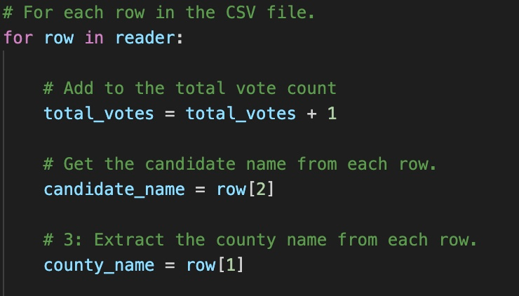

# Election Analysis

## Project Overview

Tom and Seth work for the Colorado Board of Elections and are looking to create software that can easily tally votes in a recent senate election.  They have asked that I write a script that will answer the following questions and present the findings in a report.

1. Calculate the total number of votes casted.
2. Get A complete list of candidates who received votes.
3. Calculate the percentage of votes each candidate won.
4. Calculate the total number of votes each candidate won.
5. Determine the winner of the election based on popular vote.

We will also need to determine the following regarding the county:
1. The number of votes per county
2. The county with the highest turnout

## Resources

- Data Source: elections_results.csv
- Software: Python 3.7.6., Visual Studio Code 1.66.1

## Results

### Candidate results

There were a total of 369,711 casts in the election.

 - Candidate Charles Casper Stockham received 23.0% of the total votes: (85,213).

 - Candidate Diana DeGette received 73.8% of the total votes: (272,892).

 - Candidate Raymon Anthony Doane received 3.1% of the total votes (11,606).

### County Results
 - Denver county had the largest turnout with 306,055 votes in total, which is 82.78% of the overall vote. 
 
 - Jefferson county had a total of 38,855 votes in total, which is 10.51% of the overall vote.
 
 - Arapahoe county had a total of 24,801 votes in total, which is 6.71% of the overall vote.

### Election Outcome

The declared winner is Diana DeGette who received a total of 272,892 of a total 369,711 votes casted, or 73.8%.
- Diana received the highest number of votes and highest percentage of votes among the 3 candidates.

## Election Audit Summary

The election script as written can be applied to any election results with the same information.  Here are some items to consider:
 1. The script is arranged in such a way that the variables can be applied to any set of data that is arranged in a similar format as election_results.csv.  If data provided is not arranged in such a manner, the code itself can be changed to allocate certain variables to align with the appropriate column.  For example, to extract both the county names and candidate names to count each for their respective categories, we need to reference the column where the information lives. By altering the index where this information exists on any CSV file, this can be applied to any future election result.

 
